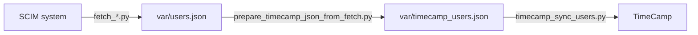

# TimeCamp SCIM Integrations

Scripts to synchronize users from various HR/SCIM systems to TimeCamp using TimeCamp REST API. Currently supports:
- LDAP
- Azure AD / Microsoft Entra ID
- BambooHR
- Factorial

## Quick Start

Follow these steps to sync your SCIM system data with TimeCamp:

```sh
# 1. Create your .env file using the provided template (look at docs/.env.example for reference)

# 2. Pull employee data from your SCIM system to json file (replace with your specific SCIM fetch script if different)
python fetch_ldap.py

# 3. Convert the SCIM data format to match TimeCamp's requirements
python prepare_timecamp_json_from_fetch.py
python scripts/display_timecamp_tree.py > var/structure.txt # Optional: preview the organizational structure
python scripts/display_timecamp_tree.py --html var/structure.html # Optional: generate HTML visualization

# 4. Upload the transformed data to TimeCamp using TimeCamp REST API
python timecamp_sync_users.py
python timecamp_sync_users.py --dry-run # Simulate without making changes
```

**⚠️ BILLING WARNING**

AUTOMATIC SEAT UPGRADES: If your TimeCamp account doesn't have enough paid seats for all users being synced, additional seats will be automatically added and charged to your account. Review your user count before proceeding to avoid unexpected billing charges.

## Architecture



1. Fetch users from SCIM system to json file (fetch_*.py) ► output: var/users.json
2. Convert the SCIM data format to match TimeCamp's requirements and do filtering/transforming (prepare_timecamp_json_from_fetch.py) ► input: var/users.json ► output: var/timecamp_users.json
3. Upload the transformed data to TimeCamp using TimeCamp REST API (timecamp_sync_users.py) ► input: var/timecamp_users.json

## Documentation

- **[docs/env.example](docs/env.example)** - Environment variable configuration list ⚠️
- **[docs/fetch_azure.md](docs/fetch_azure.md)** - Fetching users from Azure AD / Entra ID
- **[docs/fetch_ldap.md](docs/fetch_ldap.md)** - Fetching users from LDAP
- **[docs/docker.md](docs/docker.md)** - Docker and compose usage
- **[docs/crontab.md](docs/crontab.md)** - Cron setup for scheduled runs
- **[docs/tests.md](docs/tests.md)** - Comprehensive testing guide with instructions

## Todo

- [x] Refactor readme.md and docs
- [ ] TIMECAMP_DISABLE_NEW_USERS= change to TIMECAMP_SKIP_NEW_USERS_CREATION (if old name is used, fail with error and instruction)
- [ ] TIMECAMP_DISABLE_USER_DEACTIVATION= change to TIMECAMP_SKIP_USER_DEACTIVATION (if old name is used, fail with error and instruction)
- [ ] TIMECAMP_DISABLE_MANUAL_USER_UPDATES= to TIMECAMP_SYNC_MANUALLY_ADDED_USERS (if old name is used, fail with error and instruction)
- [ ] TIMECAMP_SHOW_EXTERNAL_ID= to TIMECAMP_SHOW_EXTERNAL_ID_IN_USERNAMES (if old name is used, fail with error and instruction)
- [ ] Use TIMECAMP_PREPARE_TRANSFORM_CONFIG instead of TIMECAMP_CHANGE_GROUPS_REGEX (if old name is used, fail with error and instruction)
- [ ] Use TIMECAMP_PREPARE_TRANSFORM_CONFIG instead of TIMECAMP_EXCLUDE_REGEX (if old name is used, fail with error and instruction)
- [ ] Use TIMECAMP_PREPARE_TRANSFORM_CONFIG instead of TIMECAMP_SKIP_DEPARTMENTS (if old name is used, fail with error and instruction)

## License

MIT
