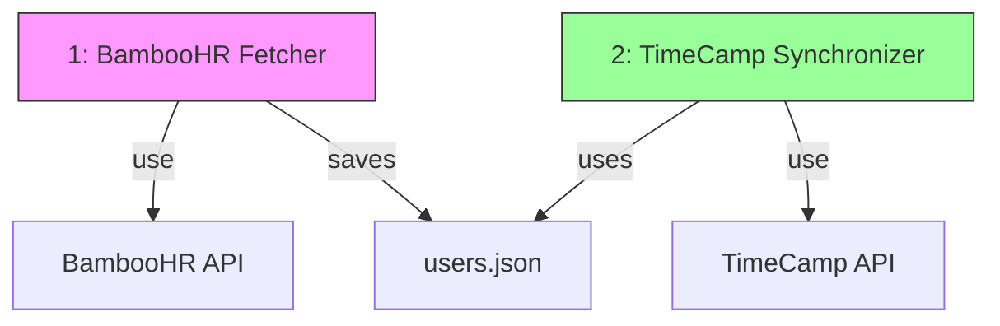

# TimeCamp SCIM Integrations

Scripts to synchronize users from various HR systems with TimeCamp. Currently supports:
- BambooHR

## Setup

1. Clone the repository
2. Install dependencies:
```bash
pip3 install -r requirements.txt
```
3. Copy `.env.sample` to `.env` and fill in your API keys:
```bash
cp .env.sample .env
```

## System Architecture



## Testing

Always test the integration first using these steps:

1. Test BambooHR fetch:
```bash
# Fetch users from BambooHR and save to users.json
python bamboohr_fetch.py
```

2. Review the generated `users.json` to ensure the data is correct. The file should match the format shown in `users.json.sample`:
```json
{
  "users": [
    {
      "external_id": "123",
      "name": "John Doe",
      "email": "john.doe@example.com",
      "department": "Engineering",
      "status": "active"
    }
  ]
}
```

3. Test TimeCamp sync with dry-run:
```bash
# Test sync without making any changes
python timecamp_sync.py --dry-run
```

4. If the dry run looks good, run the actual sync:
```bash
python timecamp_sync.py
```

## Crontab Setup

To automate the synchronization, add these entries to your crontab:

```bash
# Edit crontab
crontab -e

# Add these lines:

# Fetch users from BambooHR every hour
0 * * * * cd /path/to/project && python3 bamboohr_fetch.py

# Sync with TimeCamp 5 minutes after fetch
5 * * * * cd /path/to/project && python3 timecamp_sync.py
```

Notes:
- Replace `/path/to/project` with the actual path to your project
- Replace `python3` with the path to your Python interpreter (find it using `which python3`)
- All operations are logged to `logs/sync.log`

## Troubleshooting

1. Check the logs:
   - For real-time output: Watch the script execution in terminal
   - For historical data: Check `logs/sync.log`
2. Ensure all required environment variables are set in `.env`
3. Verify API keys have the necessary permissions
4. For crontab issues, check system logs: `grep CRON /var/log/syslog`

## Not Yet Implemented

- User roles
- Performance
- Change of email (use external_id to identify)
- Remove empty groups
- Setting to sync only selected things (no groups)
- Setting to move disabled users to specific group_id

## Test Cases

- User changed name ✅
- User changed group ✅
- User added ✅
- User disabled ✅
- User removed ✅
- User added as inactive ✅
- User added with empty department ✅
- Group name with whitespaces near / ✅
- Setting enabled to add external_id to user name

## License

MIT