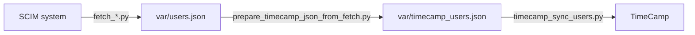

# TimeCamp SCIM Integrations

Sync users and organizational structure from HR/SCIM sources into TimeCamp using the
TimeCamp REST API. The workflow is always: fetch users -> transform -> sync.

Supported sources:
- LDAP
- Azure AD / Microsoft Entra ID
- BambooHR
- Factorial

## Quick Start

```sh
# 1. Create your .env file (see docs/.env.example for the full list)
cp .env.sample .env

# 2. Fetch employees from your source system (pick one)
uv run fetch_ldap.py
# uv run fetch_azuread.py
# uv run fetch_bamboohr.py
# uv run fetch_factorialhr.py

# 3. Transform to the TimeCamp format
uv run prepare_timecamp_json_from_fetch.py
uv run scripts/display_timecamp_tree.py > var/structure.txt # Optional preview
uv run scripts/display_timecamp_tree.py --html var/structure.html # Optional HTML

# 4. Sync to TimeCamp
uv run timecamp_sync_users.py
uv run timecamp_sync_users.py --dry-run # Simulate without making changes
```

> **⚠️ BILLING WARNING** AUTOMATIC SEAT UPGRADES: If your TimeCamp account doesn't have enough paid seats for all users being synced, additional seats will be automatically added and charged to your account. Review your user count before proceeding to avoid unexpected billing charges.

## Architecture



1. Fetch users from your HR/SCIM system (`fetch_*.py`) -> output: `var/users.json`
2. Transform and filter to TimeCamp format (`prepare_timecamp_json_from_fetch.py`) -> output: `var/timecamp_users.json`
3. Upload to TimeCamp (`timecamp_sync_users.py`)

## Configuration

- `docs/.env.example` has the complete environment variable list
- `.env.sample` is a minimal starter template

## Documentation

- **[docs/.env.example](docs/.env.example)** - Environment variable configuration list
- **[docs/fetch_azure.md](docs/fetch_azure.md)** - Fetching users from Azure AD / Entra ID
- **[docs/fetch_ldap.md](docs/fetch_ldap.md)** - Fetching users from LDAP
- **[docs/docker.md](docs/docker.md)** - Docker and compose usage
- **[docs/crontab.md](docs/crontab.md)** - Cron setup for scheduled runs
- **[docs/tests.md](docs/tests.md)** - Comprehensive testing guide with instructions

## License

MIT
