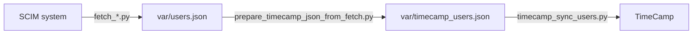

# TimeCamp SCIM Integrations

Sync users and organizational structure from HR/SCIM sources into TimeCamp using the
TimeCamp REST API. The workflow is always: fetch users -> transform -> sync.

Supported sources:
- LDAP
- Azure AD / Microsoft Entra ID
- Okta
- BambooHR
- Factorial
- HiBob

## Quick Start

```sh
# 1. Create your .env file (see docs/.env.example for the full list)
cp .env.sample .env

# 2. Fetch employees from your source system (pick one)
uv run --python 3.14 --with-requirements requirements.txt fetch_ldap.py
# uv run fetch_azuread.py
# uv run fetch_okta.py
# uv run fetch_bamboohr.py
# uv run fetch_hibob.py
# uv run fetch_factorialhr.py

# 3. Transform to the TimeCamp format
uv run --python 3.14 --with-requirements requirements.txt prepare_timecamp_json_from_fetch.py
uv run --python 3.14 --with-requirements requirements.txt scripts/display_timecamp_tree.py > var/structure.txt # Optional preview
uv run --python 3.14 --with-requirements requirements.txt scripts/display_timecamp_tree.py --html var/structure.html # Optional HTML

# 4. Sync to TimeCamp
uv run --python 3.14 --with-requirements requirements.txt timecamp_sync_users.py
uv run --python 3.14 --with-requirements requirements.txt timecamp_sync_users.py --dry-run # Simulate without making changes
```

> **⚠️ BILLING WARNING** AUTOMATIC SEAT UPGRADES: If your TimeCamp account doesn't have enough paid seats for all users being synced, additional seats will be automatically added and charged to your account. Review your user count before proceeding to avoid unexpected billing charges.

## Architecture


```mermaid
flowchart LR
    scim[SCIM system] -->|fetch_*.py| users[var/users.json]
    users -->|prepare_timecamp_json_from_fetch.py| timecamp_users[var/timecamp_users.json]
    timecamp_users -->|timecamp_sync_users.py| timecamp[TimeCamp]
```

1. Fetch users from your HR/SCIM system (`fetch_*.py`) -> output: `var/users.json`
2. Transform and filter to TimeCamp format (`prepare_timecamp_json_from_fetch.py`) -> output: `var/timecamp_users.json`
3. Upload to TimeCamp (`timecamp_sync_users.py`)

## User custom fields

The sync can set TimeCamp user custom fields from any source system. A fetch
script adds a `custom_fields` object to each user in `var/users.json`. The keys
are TimeCamp user custom field names:

```json
{
  "users": [
    {
      "external_id": "1001",
      "name": "Sample User",
      "email": "sample.user@example.com",
      "department": "Engineering",
      "status": "active",
      "custom_fields": {
        "Job Position": "Developer",
        "Cost Center": null
      }
    }
  ]
}
```

- A string value sets the TimeCamp field. Numbers and booleans are converted to text. Lists are joined with `, `.
- `null` or an empty string clears the TimeCamp field.
- A field that is not in `custom_fields` is not changed.
- The custom fields must already exist in TimeCamp as user custom fields. The sync matches them by name. If a name does not match, the sync logs a warning and skips that field.
- The TimeCamp account needs the Custom Fields module, and the `TIMECAMP_API_KEY` user must be able to read and change custom field values. If TimeCamp refuses access, the sync logs an error and continues without custom fields.
- The sync does not clear required custom fields, and it skips values that are not numbers for number fields.
- The sync reads the current values in bulk and sends only the values that changed.

`prepare_timecamp_json_from_fetch.py` writes these values to
`timecamp_custom_fields` in `var/timecamp_users.json`. Set
`TIMECAMP_DISABLE_CUSTOM_FIELDS_SYNC=true` to turn off the sync of custom
fields.

Sources with a built-in custom field mapping:
- Okta: `OKTA_TIMECAMP_CUSTOM_FIELDS` (see [docs/fetch_okta.md](docs/fetch_okta.md))

For other sources, use `common.custom_fields.extract_custom_fields` in the
fetch script, or write the `custom_fields` object directly.

## Configuration

- `docs/.env.example` has the complete environment variable list
- `.env.sample` is a minimal starter template

## Documentation

- **[docs/.env.example](docs/.env.example)** - Environment variable configuration list
- **[docs/fetch_azure.md](docs/fetch_azure.md)** - Fetching users from Azure AD / Entra ID
- **[docs/fetch_okta.md](docs/fetch_okta.md)** - Fetching users from Okta
- **[docs/fetch_hibob.md](docs/fetch_hibob.md)** - Fetching users from HiBob
- **[docs/fetch_ldap.md](docs/fetch_ldap.md)** - Fetching users from LDAP
- **[docs/docker.md](docs/docker.md)** - Docker and compose usage
- **[docs/crontab.md](docs/crontab.md)** - Cron setup for scheduled runs
- **[docs/tests.md](docs/tests.md)** - Comprehensive testing guide with instructions

## FAQ

### How to get TIMECAMP_ROOT_GROUP_ID?

The easiest way is to open Users tab (https://app.timecamp.com/app#/settings/users), then click `Cog` icon near first/root group name to open group settings, then copy id from url.

## License

MIT
