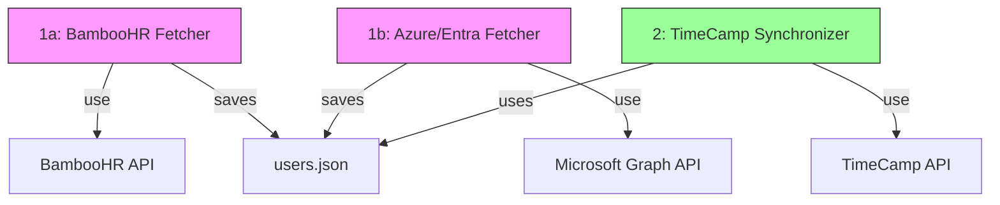

# TimeCamp SCIM Integrations

Scripts to synchronize users from various HR systems with TimeCamp. Currently supports:
- BambooHR
- Azure AD / Microsoft Entra ID
- LDAP

## Setup

1. Clone the repository
2. Install dependencies:
```bash
pip3 install -r requirements.txt
```
3. Copy `.env.sample` to `.env` and fill in your API keys:
```bash
cp .env.sample .env
```

## System Architecture



## LDAP

- Set the environment variables: `LDAP_HOST`, `LDAP_PORT`, `LDAP_DOMAIN`, `LDAP_DN`, `LDAP_USERNAME`, and `LDAP_PASSWORD`
- Optionally set `LDAP_FILTER` to customize the user filter query (default filter includes only active users)
- Optionally set `LDAP_PAGE_SIZE` to control the number of results retrieved per page (default is 1000)
- Optionally set `LDAP_USE_SAMACCOUNTNAME=true` to generate email addresses from sAMAccountName rather than using the mail attribute
- Optionally set `LDAP_USE_OU_STRUCTURE=true` to use the organizational unit (OU) structure from user's DN as the department value instead of the department attribute
- Optionally set other params like `TIMECAMP_USE_SUPERVISOR_GROUPS=false`
- Run `python ldap_fetch.py` to fetch users from LDAP
- Note: When using sAMAccountName for email, the original mail attribute is always included as `real_email` field if available

## Azure AD / Microsoft Entra ID Setup

1. Register an application in Azure AD/Entra ID portal:
   - Go to Azure Portal > Azure Active Directory > App registrations > New registration
   - Name your application (e.g., "TimeCamp SCIM Integration")
   - Select "Accounts in this organizational directory only"
   - Click Register
   - Note down the Application (client) ID and Directory (tenant) ID

2. Create a client secret:
   - Go to your app > Certificates & secrets > New client secret
   - Give it a description (e.g., "SCIM Integration")
   - Select an expiration (e.g., 24 months)
   - Click Add
   - IMMEDIATELY copy the "Value" column (NOT the Secret ID)
   - ⚠️ The secret value will only be shown once and looks like `kv~8Q~...`
   - If you copied the wrong value or lost it, create a new secret

3. Configure API permissions:
   - Go to your app > API permissions
   - Click "Add a permission"
   - Select "Microsoft Graph" > "Application permissions"
   - Add these permissions:
     * Directory.Read.All
     * User.Read.All
     * Group.Read.All
   - Click "Grant admin consent" button

4. Configure OAuth credentials in `.env`:
```bash
AZURE_TENANT_ID=your-tenant-id  # Directory (tenant) ID
AZURE_CLIENT_ID=your-client-id  # Application (client) ID
AZURE_CLIENT_SECRET=your-client-secret  # The secret value you copied
```

5. (Optional) Configure email preference:
   - By default, the script uses the federated ID (userPrincipalName) as the primary email
   - To use real email addresses (mail attribute) when available, add this to your `.env`:
```bash
AZURE_PREFER_REAL_EMAIL=true
```

6. Fetch users and groups from Azure AD:
```bash
python3 azuread_fetch.py
```
   - This script will automatically handle token management and fetch users and groups
   - If the token expires or becomes invalid, the script will automatically refresh it

## Testing

Always test the integration first using these steps:

1. Test user fetch from your chosen source:
```bash
# For BambooHR:
python bamboohr_fetch.py

# For Azure AD / Microsoft Entra ID:
python azuread_fetch.py
```

2. Review the generated files to ensure the data is correct:
   - For both sources, check `users.json` matches the format shown in `users.json.sample`
   - For Azure AD, the users.json file will include group memberships in the "groups" field for each user

3. Test TimeCamp sync with dry-run:
```bash
# Test sync without making any changes
python timecamp_sync.py --dry-run
```

4. If the dry run looks good, run the actual sync:
```bash
python timecamp_sync.py
```

## Crontab Setup

To automate the synchronization, add these entries to your crontab:

```bash
# Edit crontab
crontab -e

# Add these lines (choose one source):

# For BambooHR:
# Fetch users from BambooHR every hour
0 * * * * cd /path/to/project && python3 bamboohr_fetch.py

# For Azure AD / Microsoft Entra ID:
# Fetch users and groups every hour (token refresh is handled automatically)
0 * * * * cd /path/to/project && python3 azuread_fetch.py

# Sync with TimeCamp 5 minutes after fetch
5 * * * * cd /path/to/project && python3 timecamp_sync.py
```

Notes:
- Replace `/path/to/project` with the actual path to your project
- Replace `python3` with the path to your Python interpreter (find it using `which python3`)
- All operations are logged to `logs/sync.log`

## Troubleshooting

1. Check the logs:
   - For real-time output: Watch the script execution in terminal
   - For historical data: Check `logs/sync.log`
2. Ensure all required environment variables are set in `.env`
3. Verify API keys have the necessary permissions
4. For crontab issues, check system logs: `grep CRON /var/log/syslog`
5. For Azure AD token issues:
   - The script automatically handles token refresh when needed
   - If you're still having issues, you can manually force a token refresh by deleting the `AZURE_BEARER_TOKEN` line from your `.env` file and running the script again
6. Run script with `--debug` param

## Not Yet Implemented

- Setting to sync only selected things (like only new users)
- Setting to move disabled users to specific group_id
- Remove empty groups
- Change of email (use external_id to identify user)
- Refactor deparments and use array instead of string

## Test Cases

- User changed name ✅
- User changed group ✅
- User added ✅
- User disabled ✅
- User removed ✅
- User added as inactive ✅
- User added with empty department ✅
- Group name with whitespaces near / ✅
- Setting enabled to add external_id to user name ✅
- Don't send automatic email when user is created ✅
- Setting and updating real user email as second email setting in TimeCamp ✅
- Update user roles based on supervisor ✅
- Update user external id ✅
- Matching users based on TC email or TC additional email ✅
- Creating TimeCamp groups based on supervisor ✅
   - User A (no supervisor) → Group A
   - User B (supervisor: A) → Group "A/B"
   - User C (supervisor: B) → Group "A/B"
   - User D (supervisor: A) → Group "A"
   - User E (no supervisor, not a supervisor) → root group id

## License

MIT